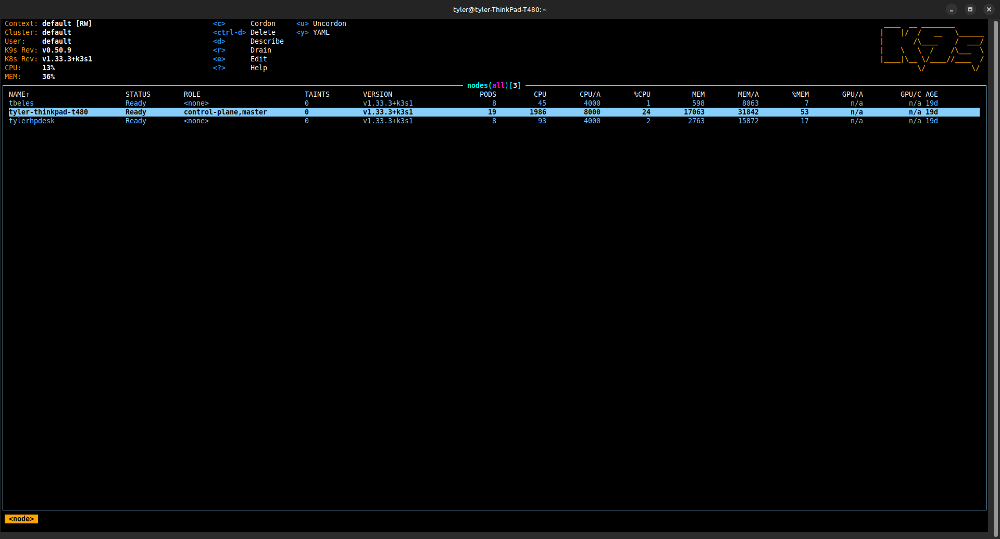

# Linux Kubernetes Cluster

A complete K3s homelab setup with centralized dashboard, monitoring, automation, and network services.

## 📋 Dashboard


*Centralized Homer dashboard providing easy access to all homelab services*

## 🏗️ Infrastructure

**Controller Node**: ThinkPad laptop
**Worker Nodes**: 
- Raspberry Pi (running Pi-hole)
- EliteDesk (planned for n8n automation)

## 🌐 Networking Architecture

### Cilium CNI with L2 LoadBalancer
This homelab uses **Cilium** as the Container Network Interface (CNI) with L2 announcement policies for LoadBalancer services, providing direct Layer 2 network integration.

**Why Cilium over traditional solutions:**
- **Enhanced Security**: eBPF-based network policies with Layer 7 filtering
- **Performance**: Kernel-bypass networking with eBPF programs
- **Observability**: Built-in network monitoring and troubleshooting
- **L2 Announcements**: Native LoadBalancer support without external dependencies

### LoadBalancer Service Architecture
Services are exposed using **LoadBalancer** type with dedicated IP addresses via Cilium's L2 announcement policy:

```yaml
# Cilium L2 Announcement Policy
interfaces: [^eth[0-9]+$, ^enp[0-9]+s[0-9]+$, ^enx[a-f0-9]+$]
loadBalancerIPs: true
```

**Benefits over NodePort/Ingress:**
- **Direct Access**: Services accessible via dedicated IPs without port conflicts
- **Simplified Routing**: No need for Ingress controllers or reverse proxies  
- **Network Integration**: Services appear as first-class network citizens
- **Protocol Support**: Full TCP/UDP support (not just HTTP/HTTPS)

### Service IP Allocation
| Service | IP Address | Ports | Purpose |
|---------|------------|-------|---------|
| Pi-hole | 192.168.1.210 | 53 (DNS), 80 (Web) | Network-wide DNS filtering |
| Cilium Ingress | 192.168.1.211 | 80, 443 | HTTP/HTTPS ingress (future use) |
| Grafana | 192.168.1.212 | 3000 | Metrics visualization |
| Prometheus | 192.168.1.213 | 9090 | Metrics collection |
| Homer Dashboard | 192.168.1.225 | 80 | Centralized service dashboard |

### DNS Configuration
- **Primary DNS**: Pi-hole (192.168.1.210) for ad-blocking and local resolution
- **Network Integration**: Direct LoadBalancer IPs eliminate DNS complexity
- **Failover**: Kubernetes CoreDNS for cluster-internal resolution

## 📊 Monitoring & Management

### Cluster Monitoring


*Real-time cluster monitoring and management with k9s*

### Metrics Stack
- **Metrics**: Prometheus (http://192.168.1.213:9090)
- **Visualization**: Grafana (http://192.168.1.212:3000)
- **Cluster Management**: k9s terminal interface

## 🚀 Services & Applications

### 🛡️ Network Infrastructure
**Pi-hole** (http://192.168.1.210)
- **Purpose**: Network-wide DNS filtering and ad-blocking
- **Function**: Blocks malicious domains, trackers, and advertisements at the DNS level
- **Benefits**: Improves browsing speed, reduces data usage, protects all network devices
- **Features**: Custom blocklists, query logging, network-wide statistics

**Homer Dashboard** (http://192.168.1.225)  
- **Purpose**: Centralized service discovery and access portal
- **Function**: Single dashboard providing organized access to all homelab services
- **Benefits**: Eliminates need to remember IP addresses and ports
- **Features**: Service health monitoring, organized service categories

### 📊 Monitoring & Observability
**Prometheus** (http://192.168.1.213:9090)
- **Purpose**: Metrics collection and time-series database
- **Function**: Scrapes metrics from all cluster nodes and applications
- **Benefits**: Historical performance data, alerting capabilities
- **Features**: PromQL queries, service discovery, alert rules

**Grafana** (http://192.168.1.212:3000)
- **Purpose**: Metrics visualization and dashboarding
- **Function**: Creates interactive dashboards from Prometheus metrics
- **Benefits**: Visual insights into system performance and health
- **Features**: Custom dashboards, alerting, data exploration

**Node Exporter** (Running on all nodes)
- **Purpose**: System-level metrics collection
- **Function**: Exports hardware and OS metrics (CPU, memory, disk, network)
- **Benefits**: Infrastructure monitoring and capacity planning

### 🤖 Automation & Workflows  
**n8n** (Available via Ingress)
- **Purpose**: Workflow automation and integration platform
- **Function**: Creates automated workflows between different services and APIs
- **Benefits**: Reduces manual tasks, integrates disparate systems
- **Features**: Visual workflow editor, 400+ integrations, webhook support

### 🎬 Media & Entertainment
**Jellyfin** (Available via LoadBalancer)
- **Purpose**: Self-hosted media streaming server
- **Function**: Organizes and streams movies, TV shows, and music
- **Benefits**: Private Netflix-like experience without subscription fees
- **Features**: Transcoding, mobile apps, user management

### Applications
- **Password Manager**: 
  - **Language**: Java 11
  - **Database**: PostgreSQL  
  - **Security**: AES-256 encryption with PBKDF2 key derivation
  - **Features**: Multi-user support, encrypted password storage


## 🚧 Work in Progress

### Media Server
- **Status**: Planning/Development
- **Purpose**: Media streaming and management
- **Planned Features**: Movie/TV show streaming, media library organization

This homelab is actively being developed with more services and automation planned.